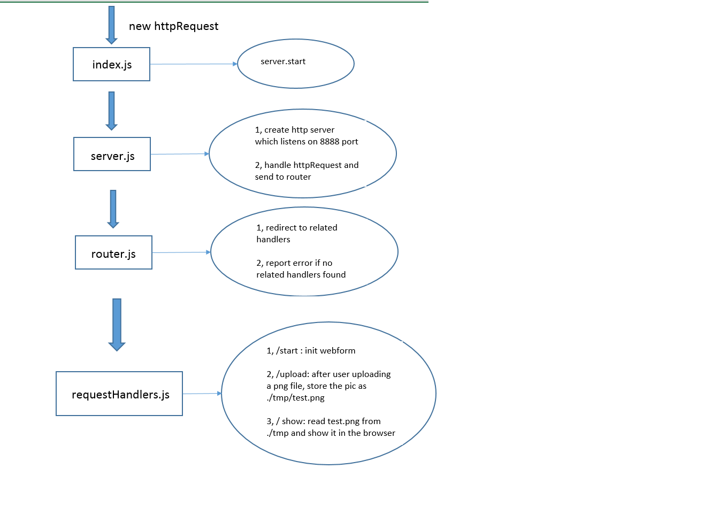

# pngUploadWebsite
    

## Purpose    
Create a local http server for png file uploading    

## Pre-installation
```javascript    
1, install node.js and npm    
2, npm install formidable    
```    

## Basic Usage
1, download the project
2, node index.js
3, choose to upload any png file
4, if successful, the webform will show the uploaded png

## The design of the project


